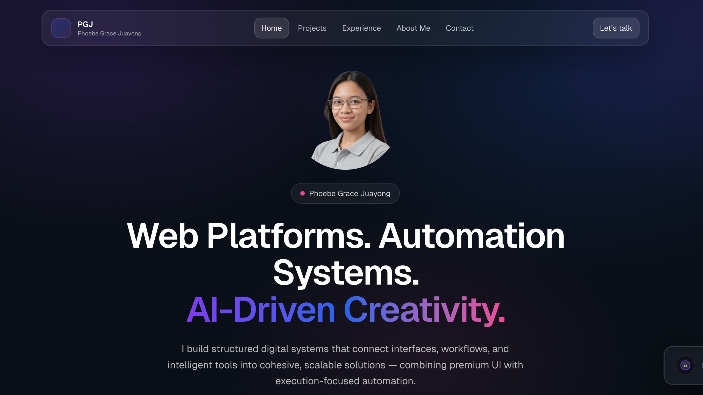

# 🌐 Phoebe Grace Juayong – Portfolio Website

## ✨ Overview

This is my personal portfolio website showcasing selected projects across:

- Web Platforms  
- Automation Systems  
- AI-Based Applications  
- Media & Creative Work  

The site is designed with a premium, modern SaaS-inspired aesthetic featuring dark UI, glassmorphism elements, smooth transitions, and responsive layouts.

---

## 🚀 Tech Stack

### Programming
- Next.js  
- React  
- TypeScript  
- JavaScript  
- Python  
- C  
- HTML  
- CSS  
- Tailwind CSS  

### Platforms & Tools
- GoHighLevel  
- ActiveCampaign  
- Mailchimp  
- ClickFunnels  
- Shopify  
- Zapier  
- WordPress  
- Google Analytics  

### Creative & AI
- Adobe Premiere Pro  
- Photoshop  
- Illustrator  
- Canva  
- Figma  
- OpenAI  
- AI Model Training  
- Emotion Classification Systems  

---

## 🎯 Core Features

- Experience-based project filtering dropdown  
- Category filtering (Systems, Web, AI, Media)  
- Dynamic project modal with media carousel  
- Embedded YouTube demos  
- Auto-preview image sliders  
- Responsive mobile tab layout (horizontal scroll)  
- Branded tool icons in Skills section  
- Tooltip system for truncated labels  
- Glassmorphism UI styling  

---

## 📂 Project Structure

